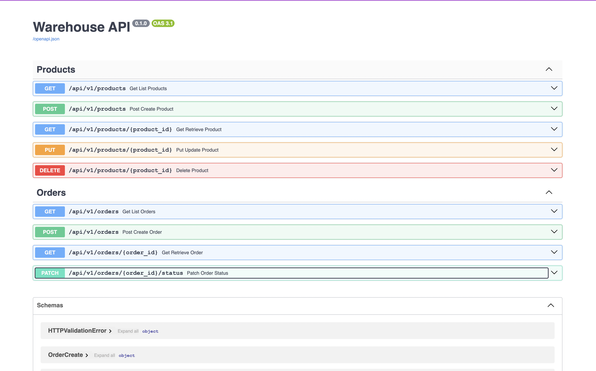

# Warehouse API для управления складом

## Задание: Разработка API для управления складом



### Структура проекта
```text..
..
├── Dockerfile
├── LICENSE
├── README.md
├── TZ.md
├── docker-compose.yml
├── img
│   └── api.png
├── poetry.lock
├── pyproject.toml
├── src
│   ├── alembic
│   │   ├── README
│   │   ├── env.py
│   │   ├── script.py.mako
│   │   └── versions
│   │       ├── 2024_09_26_1244-150234be8314_create_products_model.py
│   │       └── 2024_09_28_2119-f4426fa6640c_added_items_column_for_order.py
│   ├── alembic.ini
│   ├── api
│   │   ├── __init__.py
│   │   └── api_v1
│   │       ├── __init__.py
│   │       ├── orders.py
│   │       └── products.py
│   ├── core
│   │   ├── __init__.py
│   │   ├── config.py
│   │   ├── models
│   │   │   ├── __init__.py
│   │   │   ├── base.py
│   │   │   ├── orders.py
│   │   │   └── products.py
│   │   └── schemas
│   │       ├── __init__.py
│   │       ├── orders.py
│   │       └── products.py
│   ├── crud
│   │   ├── __init__.py
│   │   ├── orders.py
│   │   └── products.py
│   ├── db
│   │   ├── __init__.py
│   │   └── session.py
│   ├── main.py
│   ├── structure.txt
│   ├── tests
│   │   ├── __init__.py
│   │   ├── api
│   │   │   ├── __init__.py
│   │   │   ├── test_orders.py
│   │   │   └── test_products.py
│   │   ├── conftest.py
│   │   ├── crud
│   │   │   ├── __init__.py
│   │   │   ├── test_orders.py
│   │   │   └── test_products.py
│   │   └── utils
│   │       ├── __init__.py
│   │       └── test_check_product_availability.py
└────── utils
        ├── __init__.py
        └── products.py
```
